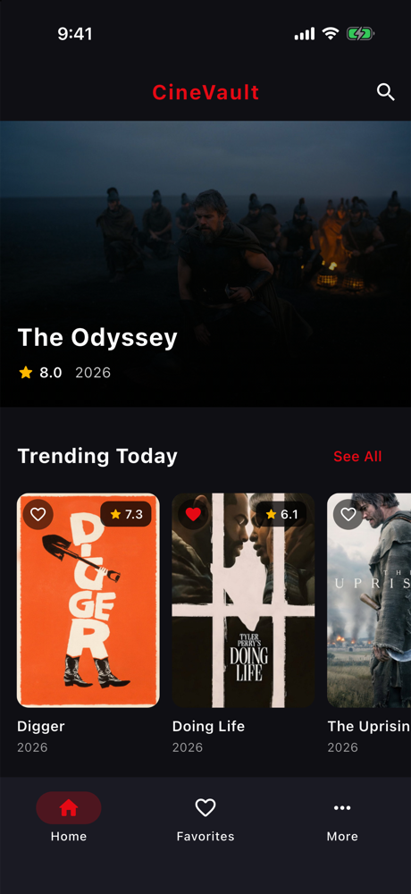
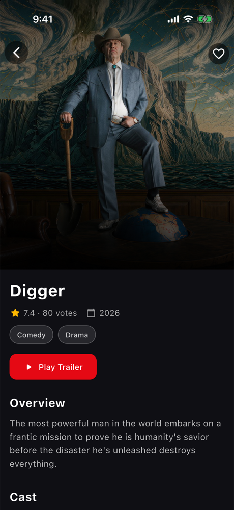
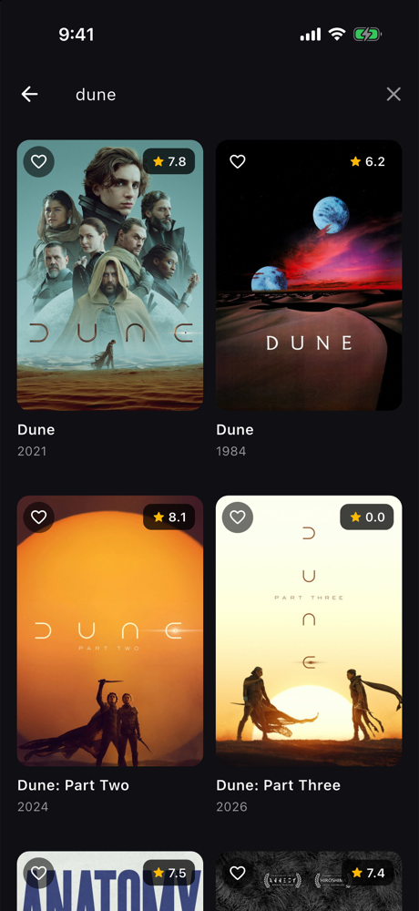
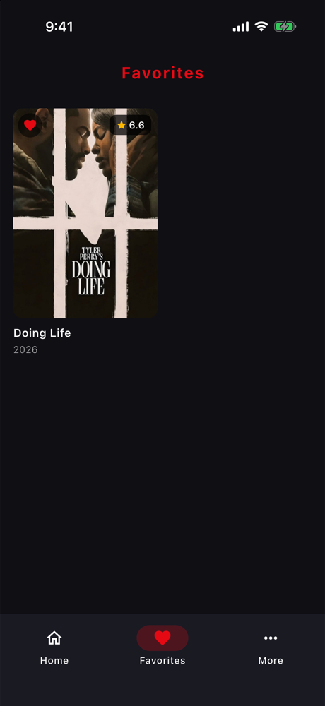
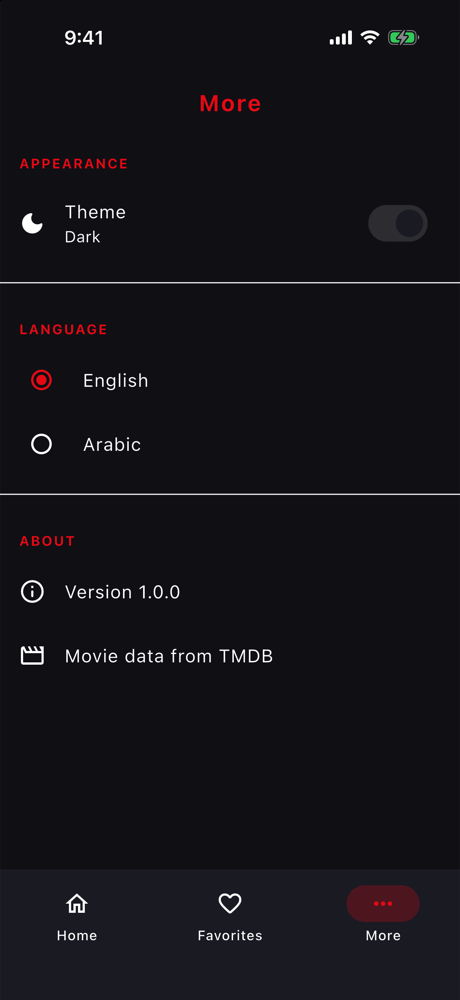
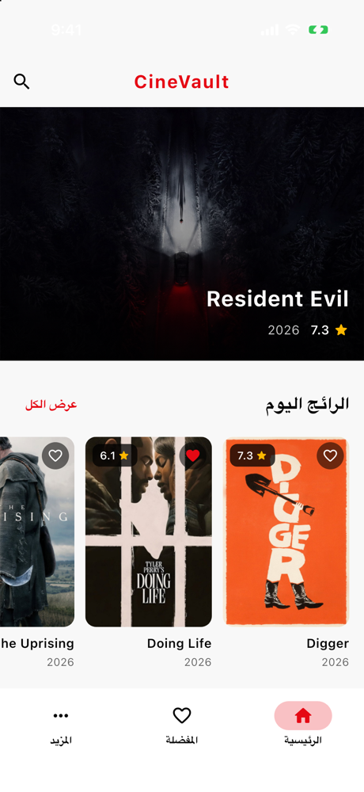

# CineVault

[](https://github.com/Isma3ilMohamed/CineVault/actions/workflows/ci.yml)


A movie app for Android and iOS built on [TMDB](https://www.themoviedb.org/), in English and
Arabic (RTL), light and dark.

Structured the way most Flutter apps are, following
[Flutter's architecture guide](https://docs.flutter.dev/app-architecture) and the Bloc / Very
Good Ventures layout: one package, features as folders, a data layer of repositories, and Bloc
for state. Covered by unit, bloc, golden and end-to-end tests that run on every push.

<p align="center">
  
  
  
  
  
  
</p>

## Features

- **Home**: featured carousel and five categories (trending, popular, top rated, now playing,
  upcoming), pull to refresh.
- **See all**: the full list of a category with infinite scroll.
- **Details**: backdrop, rating, genres, cast, similar movies, and the trailer in-app.
- **Search**: debounced, cancels stale requests, remembers recent searches.
- **Favorites**: stored on the device; the heart stays in sync on every screen.
- **Settings**: light/dark theme with a circular reveal animation, English/Arabic.

## Architecture

```
lib/
├── main.dart
├── app/            app.dart (MaterialApp) · di.dart (get_it) · config/ (flavors)
├── core/
│   ├── constants/  api endpoints · storage keys · durations · app info
│   ├── result/     sealed Result and Failure
│   ├── theme/      color palette → semantic colors → Material themes
│   ├── tmdb/       image URLs and display formatting
│   └── widgets/    shared widgets (poster card, movie grid, error view, ...)
├── routing/        app_routes.dart (every path as a constant) · app_router.dart · app_shell.dart
├── domain/models/  Movie · CastMember · Genre · Video · AppSettings
├── data/
│   ├── repositories/  abstract repositories and their implementations
│   ├── sources/       TMDB API and local storage
│   ├── models/        DTOs (JSON ↔ domain)
│   └── network/ · error/ · storage/   Dio client, processCall, guard, storageCall
├── features/<feature>/
│   ├── bloc/       <feature>_bloc.dart + _event.dart + _state.dart (freezed)
│   └── view/       <feature>_page.dart · <feature>_view.dart · widgets/
└── l10n/           app_en.arb · app_ar.arb
```

**Each screen** has a `bloc/` and a `view/`:

| File | Responsibility |
|---|---|
| `*_page.dart` | Entry: provides the bloc, sends the first event, navigates with `AppRoutes` |
| `*_view.dart` | The UI: `BlocBuilder` + widgets, sends events to the bloc |
| `*_bloc.dart` | The logic, in pure Dart (`package:bloc`) |
| `*_event.dart` · `*_state.dart` | Events and states, freezed sealed classes |

### Highlights

- **Errors as values.** Repositories return a sealed `Result`; the UI shows a localized message
  per `Failure` type. Network and storage calls go through one wrapper each (`processCall`,
  `storageCall`), so there is no `try/catch` in the repositories.
- **No hand-written strings.** Paths and route parameters live in `AppRoutes` / `RouteParams`,
  endpoints, storage keys and durations in `core/constants`, user-facing text in the ARB files.
- **Explicit DI.** `lib/app/di.dart` registers everything in order (storage, network,
  repositories, app-wide state, blocs), readable top to bottom.
- **Plain URLs.** Hero tags travel as query parameters, so every location also works as a deep
  link; invalid ones land on an error screen.
- **Images decoded at display size** (`memCacheWidth` from the layout and device pixel ratio),
  aware of the source aspect ratio so cover-fit images never upscale.

The rationale and the decisions along the way are in
[ARCHITECTURE_NOTES.md](ARCHITECTURE_NOTES.md) (written in Arabic).

## Tech stack

| | |
|---|---|
| State | `flutter_bloc`, `freezed` |
| Navigation | `go_router` |
| DI | `get_it` |
| Networking | `dio` |
| Storage | `hive`, `shared_preferences` |
| Images | `cached_network_image` |
| Lint | `very_good_analysis` |
| Tests | `flutter_test`, `bloc_test`, `mocktail`, golden files |

## Getting started

**Requirements:** Flutter 3.47 (Dart 3.13), Xcode for iOS, JDK 17 for Android.

1. **Get the dependencies:**
   ```bash
   flutter pub get
   ```
2. **Add your TMDB token.** Create an account on [TMDB](https://www.themoviedb.org/signup), then
   copy the *API Read Access Token* from Settings → API. Put it in both config files:
   ```bash
   cp config/staging.env.example config/staging.env
   cp config/production.env.example config/production.env
   ```
   These files are git-ignored. The app refuses to start if the flavor and the config don't match.
3. **Run** (a flavor is required):
   ```bash
   flutter run --flavor staging --dart-define-from-file=config/staging.env
   ```

| Flavor | Android app id | iOS bundle id | Network logs |
|---|---|---|---|
| staging | `com.ismail.cine_vault_temp.staging` | `com.ismail.cineVaultTemp.staging` | ✅ |
| production | `com.ismail.cine_vault_temp` | `com.ismail.cineVaultTemp` | ❌ |

Android Studio users can pick the **staging** / **production** run configurations in `.run/`.

## Development

```bash
dart format .                  # format
flutter analyze --fatal-infos  # analyze (very_good_analysis)
flutter test                   # every test
dart run build_runner build --delete-conflicting-outputs   # after changing a freezed class
flutter gen-l10n               # after changing an .arb file
```

Generated code (freezed, localizations) is committed, so a fresh clone builds without running
`build_runner`. CI fails if it is out of date.

## Testing

- **Unit tests** for the data layer: DTO parsing, `processCall` / `guard` error mapping, the
  repositories (including the trailer selection and the category endpoints).
- **Bloc tests** for every bloc, including the race conditions (a slow old search never
  overwrites newer results).
- **Golden tests** for every screen state, in English and Arabic: each view is pumped with a mock
  bloc. Regenerate after an intended UI change with `flutter test --update-goldens`.
- **End-to-end tests** (`test/app_test.dart`): the real app with the real DI, routes and storage,
  against a fake TMDB HTTP adapter, so the main flows run without a device or network.

## CI/CD

| Workflow | When | What |
|---|---|---|
| [CI](.github/workflows/ci.yml) | every push to `main` and every pull request | format, analyze, all tests, generated code up to date; builds the staging flavor for Android and iOS |
| [Release](.github/workflows/release.yml) | a pushed `v*` tag | builds the production APK and publishes it as a GitHub Release |

The release workflow needs the `TMDB_ACCESS_TOKEN` repository secret. Builds are signed with the
debug key until a release keystore is configured.

## Credits

Movie data and images from [TMDB](https://www.themoviedb.org/). This product uses the TMDB API
but is not endorsed or certified by TMDB.
